# Container Images

    
    
    
    
    <noscript></noscript>

---

We are out of the dev version.

All Containers can be used without breaking.

You can use all with dockserver

Don't use the images / dockers on other projects
This should not work for you.

--- 

## Before open a feature request/ pull_request or issues

1. We don't accept pull_request for other projects.
1. We don't accept any changes what breaks dockserver.
1. We dodn't give any help for other projects to run this dockers.
---

# NOTE 

This repository is heavily based on 

[Linuxserver.io](https://linuxserver.io) images and [k8s-at-home](https://k8s-at-home.com/) idea

All Containers have some additional edits just for dockserver.io

Please check before you run it on other systems

---

And the best is 

Fuck XOXO SBOX stealing code to get your product up and running is a bitch move

---

SOME fancy stats 

---

## Contributors ✨

Thanks goes to these wonderful people

<!-- ALL-CONTRIBUTORS-LIST:START - Do not remove or modify this section -->
<!-- prettier-ignore-start -->
<!-- markdownlint-disable -->

### Contributors

<table>
<tr>
    <td align="center" style="word-wrap: break-word; width: 150.0; height: 150.0">
        <a href=https://github.com/doob187>
            
             
            <b>doob187</b>
        </a>
    </td>
    <td align="center" style="word-wrap: break-word; width: 150.0; height: 150.0">
        <a href=https://github.com/drag0n141>
            
             
            <b>DrAg0n141</b>
        </a>
    </td>
    <td align="center" style="word-wrap: break-word; width: 150.0; height: 150.0">
        <a href=https://github.com/bot>
            
             
            <b>bot</b>
        </a>
    </td>
    <td align="center" style="word-wrap: break-word; width: 150.0; height: 150.0">
        <a href=https://github.com/fscorrupt>
            
             
            <b>FSCorrupt</b>
        </a>
    </td>
</tr>
<tr>
    <td align="center" style="word-wrap: break-word; width: 150.0; height: 150.0">
        <a href=https://github.com/renovate-bot>
            
             
            <b>WhiteSource Renovate</b>
        </a>
    </td>
</tr>
</table>

<!-- markdownlint-restore -->
<!-- prettier-ignore-end -->
<!-- ALL-CONTRIBUTORS-LIST:END -->
